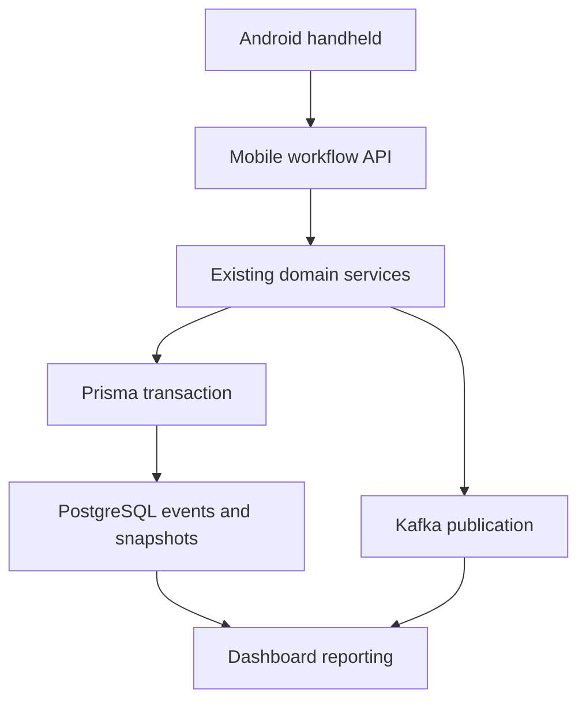

# Android Handheld Architecture and Implementation Plan

> Implementation status (July 29, 2026): the backend mobile workflow boundary,
> task-session event/snapshot models, transactional idempotency receipts,
> ordered synchronization contract, GPS flags, reversals, snapshot lookups, and
> supervisor reporting APIs, React handheld workflow simulator, and native
> Kotlin/Compose Android client are implemented. The Android client uses Room,
> WorkManager, CameraX/ML Kit, Android Keystore storage, device feedback, and
> best-effort GPS while leaving authoritative business decisions on the server.
> See `docs/02-modules/handheld-module.md` and
> `apps/handheld-android/README.md` for implementation and setup details.

## 1. Document purpose

This document defines the target architecture and phased implementation plan for the Android handheld component of the Logistics Operations Platform.

It is intended to give Codex and project contributors enough context to implement the handheld without reopening settled product decisions. The implementation must integrate with the existing NestJS, Prisma, PostgreSQL, Kafka, JWT/RBAC, React dashboard, and operational event architecture.

The target is a portfolio-quality simulation of a realistic internal courier and transportation handheld. It is not a production deployment, but its contracts, data model, offline behaviour, auditability, and test strategy should follow production-oriented practices.

---

## 2. Current platform context

The platform is a monorepo with these relevant components:

- `apps/backend`: NestJS API using Prisma and PostgreSQL.
- `apps/frontend`: React desktop-first internal operations dashboard.
- `apps/handheld-simulator`: Event and handheld behaviour simulator.
- `apps/handheld-android`: Native Kotlin/Compose Android application.

The implemented simulator is a responsive React/Vite client of the same mobile
API. It provides the task UI, persistent local outbox, ordered synchronization,
best-effort browser GPS, scan feedback, and online/offline demo controls. It
validates the client workflow and contract. The native Android application
implements the device-specific Room, WorkManager, CameraX/ML Kit, Android
Keystore, Compose, feedback, and GPS requirements.

Existing backend capabilities include:

- Authentication and role-based access control.
- Employees and terminal assignments.
- Packages and immutable package events.
- Containers and immutable container events.
- Trailers and immutable trailer events.
- Routes.
- Dashboard reporting.

Before implementation begins, verify the actual route names, DTOs, enums, Prisma models, and service method signatures in the current repository. This plan defines the target behaviour, but implementation must extend the current code rather than create parallel business logic.

---

## 3. Finalized product decisions

### 3.1 Users and authentication

- Initial users are employees and courier drivers.
- The employee scans a badge and enters an employee ID.
- The installation must first be enrolled by an administrator. A one-time
  device credential is stored with Android Keystore-backed encryption and is
  supplied automatically; it does not add an operator login field each shift.
- No password is required for the portfolio version.
- The first login must occur online.
- An authenticated shift may continue while the device is offline.
- The employee's permanent terminal is obtained from the employee profile.
- Employees cannot change their terminal from the Android application.
- Authentication must be designed so a PIN, enterprise SSO, or stronger authentication can be added later.

### 3.2 Supported operational functions

The home screen is task based and exposes three main functions:

1. Trailer load and unload.
2. Last-mile truck loading.
3. Courier delivery.

Each main function contains more specific tasks.

| Main function | Initial subcategories |
|---|---|
| Trailer operations | Load trailer, unload trailer, load package to container, unload package from container, load closed container to trailer, unload container from trailer, close container, close trailer |
| Last-mile loading | Select route/truck, load package, remove package, view loaded packages, complete loading |
| Courier delivery | Start route, out for delivery, delivered, attempted delivery, damaged, misrouted, returned to terminal, complete route |

### 3.3 Scanning and manual entry

- Initial hardware target is a standard Android phone.
- Camera barcode scanning is required.
- Manual entry is available as a fallback.
- Supported operational identifiers are:
  - Package tracking number.
  - Trailer ID.
  - Container barcode.
  - Employee badge.
  - Terminal code.
  - Route/truck barcode.
- The scanner implementation must sit behind an interface so enterprise Zebra/DataWedge support can be added later.
- Continuous scan mode is required.
- Successful and failed scans use distinct audible and vibration feedback.

### 3.4 Trailer and container operating model

- An employee can work with multiple trailers during a shift.
- Trailer work uses an explicitly selected trailer context.
- The employee scans or enters the trailer once, then continuously scans packages.
- The employee must explicitly switch the selected trailer before scanning packages to another trailer.
- The selected trailer must always be visible on the scan screen.
- A confirmation is required before changing an active trailer when unsynchronized events remain.

Container loading uses paired scans:

1. Scan the package.
2. Scan the destination container.
3. The server or offline outbox records the package-to-container event.

Employees may therefore work across multiple containers without maintaining one permanently selected container context.

- A container must be closed before it can be loaded onto a trailer.
- A closed container is scanned onto the selected trailer.
- The dashboard flags any closed container that has not been loaded onto a trailer by the end of the shift.

### 3.5 Last-mile loading

- The employee scans the route/truck barcode to establish the loading context.
- Manual route/truck entry is available.
- Packages are scanned continuously into the selected route/truck context.
- The employee can review and remove an incorrectly loaded package through a reversal event.

### 3.6 Courier delivery

Supported statuses are:

- `OUT_FOR_DELIVERY`
- `DELIVERED`
- `ATTEMPTED_DELIVERY`
- `DAMAGED`
- `MISROUTED`
- `RETURNED_TO_TERMINAL`

Each delivery event attempts to capture:

- Latitude.
- Longitude.
- GPS accuracy in metres.
- GPS captured timestamp.
- Device event timestamp.
- Server-received timestamp.

GPS unavailability must not block delivery work. The event is accepted with a `GPS_MISSING` exception flag. Where location is available but accuracy is poor, retain the coordinates and add a `GPS_LOW_ACCURACY` flag using a configurable threshold.

Photographs, signatures, recipient names, and delivery notes are deferred. They should be listed as future capabilities, not partially implemented in the initial phases.

### 3.7 Package list and scan response

The current work list displays:

- Tracking number.
- Postal code.
- Route.
- Device scan time.
- Synchronization status.
- Operational status.
- Container or trailer context, where applicable.

The immediate scan result displays:

- Package number.
- Container, trailer, or route context.
- Accepted, pending, rejected, or reversed status.
- A concise next instruction or error message.

### 3.8 Offline operation

- All operational workflows must function offline after an initial online login.
- Unknown packages scanned offline are accepted locally as `PENDING_VALIDATION`.
- Events synchronize automatically when connectivity returns.
- Local operational history is retained for eight hours.
- Expired local history may be purged only after the event is synchronized or permanently resolved.
- Unsynchronized events must never be deleted automatically.
- The backend remains the final authority.

When the backend rejects a queued event, the operator can:

1. Correct the package or operational context and resubmit.
2. Remove a rejected event that the server never accepted.
3. Create a reversal event when the original event was accepted by the server.

### 3.9 Event reversals

- Accepted operational history is immutable.
- An incorrect accepted scan is corrected by creating a compensating reversal event.
- A reversal references the original server event ID.
- The original and reversal remain visible in audit history.
- A local rejected event that was never accepted by the backend can be dismissed locally; this is not a reversal.
- Reversals do not count as productive package scans.

### 3.10 Device and event accountability

Each operational event includes:

- Client-generated event ID.
- Device installation ID.
- Employee ID.
- Terminal ID.
- Task session ID.
- Workflow and action.
- Package tracking number, where applicable.
- Container ID, trailer ID, route ID, or truck ID, where applicable.
- Device timestamp.
- Server-received timestamp after synchronization.
- Connectivity state at capture.
- GPS details for delivery events.
- Event status and exception flags.

An automatically generated installation ID is sufficient for the portfolio version.

### 3.11 Supervisor dashboard and productivity

Dashboard results can be:

- Segregated by employee.
- Segregated by task.
- Filtered by terminal and time period.
- Aggregated at terminal level.

Required metrics include:

- Employee packages per hour.
- Terminal packages per hour.
- Accepted package scans.
- Rejected scans.
- Reversals.
- Duplicate scans.
- Damaged packages.
- Misrouted packages.
- Synchronization failures.
- GPS missing delivery events.
- Closed containers not loaded onto trailers.
- Operationally inactive employees or task sessions.

---

## 4. Core architecture

### 4.1 Architectural boundaries

The Android application is a client of the NestJS API.

It must not:

- Connect directly to PostgreSQL.
- Publish directly to Kafka.
- reproduce package, container, trailer, or route business rules locally as authoritative logic.
- Modify previously accepted event history.

The Android application may perform local pre-validation for fast operator feedback, but the NestJS backend makes the final decision.



### 4.2 Android stack

| Concern | Technology |
|---|---|
| Language | Kotlin |
| UI | Jetpack Compose and Material 3 |
| Architecture | MVVM with use-case and repository boundaries |
| Dependency injection | Hilt |
| Local database | Room/SQLite |
| Preferences | DataStore |
| Secure token storage | Android Keystore-backed encrypted storage |
| HTTP | Retrofit and OkHttp |
| JSON | Kotlin serialization or Moshi; select one consistently |
| Background synchronization | WorkManager |
| Camera scanning | CameraX with ML Kit Barcode Scanning |
| GPS | Fused Location Provider |
| Real-time updates | WebSocket client with REST fallback |
| API models | Kotlin models generated from backend OpenAPI |
| Unit tests | JUnit, MockK, Turbine |
| UI tests | Compose UI testing |
| Database tests | Room in-memory tests |

### 4.3 Android package structure

Use feature-oriented modular boundaries without over-splitting the portfolio project:

```text
apps/handheld-android/
  app/
  core/
    auth/
    database/
    designsystem/
    network/
    scanner/
    sync/
    telemetry/
  feature/
    login/
    home/
    trailer/
    container/
    lastmile/
    delivery/
    history/
    exceptions/
```

If a multi-module Gradle structure creates unnecessary overhead at the beginning, use the same package boundaries inside one application module and extract Gradle modules only after Phase 2.

### 4.4 Backend mobile workflow layer

Create a `mobile` or `handheld` NestJS module that orchestrates existing services.

Its responsibilities are:

- Mobile authentication and shift bootstrap.
- Work-session lifecycle.
- Idempotent scan command processing.
- Offline batch synchronization.
- Mobile-optimized package lookup responses.
- Reversal orchestration.
- Consistent response and exception codes.
- Real-time status updates.

It must call existing package, container, trailer, route, employee, and dashboard services. It must not fork their business rules.

### 4.5 Why use mobile-focused endpoints

One handheld action may validate and update several related entities. A mobile workflow endpoint provides:

- One atomic server operation.
- Fewer requests over unreliable connections.
- Idempotency for retries.
- A stable contract for Android.
- Consistent validation across Android and web.
- Batch synchronization with per-event results.
- Responses optimized for immediate operator feedback.

### 4.6 API contract strategy

- NestJS DTOs remain responsible for server validation and Swagger/OpenAPI metadata.
- OpenAPI is the language-neutral API contract.
- Kotlin Android request and response models are generated from OpenAPI.
- React and backend may share TypeScript types where appropriate.
- Android must not manually mirror NestJS DTO classes if generation is available.

Contract generation should be deterministic and included in project scripts or CI.

---

## 5. Mobile API design

The route names below are target contracts. Align them with the current API prefix and versioning convention.

### 5.1 Authentication and bootstrap

```text
POST /api/mobile/v1/auth/login
POST /api/mobile/v1/auth/refresh
POST /api/mobile/v1/auth/logout
GET  /api/mobile/v1/bootstrap
```

Login request:

```json
{
  "badgeBarcode": "EMP-BADGE-12345",
  "employeeId": "12345",
  "deviceId": "installation-uuid",
  "deviceCredential": "stored-and-supplied-automatically"
}
```

Bootstrap response should include:

- Employee identity and role.
- Permanent terminal and terminal code.
- Authorized tasks.
- Active shift or task sessions.
- Server time.
- API and configuration version.
- Configurable inactivity and GPS accuracy thresholds.

### 5.2 Work sessions

```text
POST /api/mobile/v1/work-sessions
POST /api/mobile/v1/work-sessions/{id}/pause
POST /api/mobile/v1/work-sessions/{id}/resume
POST /api/mobile/v1/work-sessions/{id}/complete
GET  /api/mobile/v1/work-sessions/active
```

Employees explicitly start and complete task sessions. Pause and resume remain available for breaks or planned interruptions.

The backend also applies inactivity state based on the last accepted operational activity.

### 5.3 Scans and synchronization

```text
POST /api/mobile/v1/scans
POST /api/mobile/v1/sync
GET  /api/mobile/v1/sync/status
POST /api/mobile/v1/events/{eventId}/reverse
```

Each scan command includes a unique `clientEventId`. The backend must enforce uniqueness so retries cannot duplicate operational events.

The batch sync response returns one result per submitted event:

```json
{
  "batchId": "batch-uuid",
  "results": [
    {
      "clientEventId": "event-uuid",
      "serverEventId": "server-event-id",
      "status": "ACCEPTED",
      "code": "PACKAGE_LOADED",
      "message": "Package loaded to trailer TRL-1002",
      "serverReceivedAt": "2026-07-24T22:15:00Z"
    }
  ]
}
```

Allowed result statuses:

- `ACCEPTED`
- `REJECTED`
- `DUPLICATE_ACCEPTED`
- `REVERSED`

The batch endpoint should normally return HTTP success when the batch was parsed, even if individual events are rejected. Each item reports its own business outcome.

### 5.4 Lookup and real-time status

```text
GET /api/mobile/v1/packages/{trackingNumber}
GET /api/mobile/v1/containers/{containerBarcode}
GET /api/mobile/v1/trailers/{trailerId}
GET /api/mobile/v1/routes/{routeCode}
```

Use WebSockets for near-real-time accepted/rejected status updates and server-side changes relevant to the current work session. REST remains the recovery path when the socket is unavailable.

### 5.5 Dashboard endpoints

Extend the current dashboard module rather than building a second reporting API.

```text
GET /api/dashboard/terminal-kpis/handheld
GET /api/dashboard/terminal-kpis/handheld/employees
GET /api/dashboard/terminal-kpis/handheld/exceptions
GET /api/dashboard/terminal-kpis/handheld/unloaded-containers
```

Use the project's established endpoint naming if it differs.

---

## 6. Local Android data model

### 6.1 `LocalTaskSession`

Suggested fields:

- `localSessionId`
- `serverSessionId`
- `employeeId`
- `terminalId`
- `taskType`
- `startedAt`
- `pausedAt`
- `completedAt`
- `lastAcceptedActivityAt`
- `activityState`
- `networkState`
- `selectedTrailerId`
- `selectedRouteId`
- `syncState`

### 6.2 `OutboxEvent`

Suggested fields:

- `clientEventId`
- `serverEventId`
- `localSessionId`
- `eventType`
- `trackingNumber`
- `containerBarcode`
- `trailerId`
- `routeCode`
- `deviceId`
- `employeeId`
- `terminalId`
- `deviceTimestamp`
- `serverReceivedTimestamp`
- `latitude`
- `longitude`
- `gpsAccuracyMetres`
- `gpsCapturedAt`
- `networkStateAtCapture`
- `syncStatus`
- `rejectionCode`
- `rejectionMessage`
- `exceptionFlags`
- `retryCount`
- `nextRetryAt`
- `createdAt`
- `resolvedAt`

### 6.3 `LocalPackageSummary`

Suggested fields:

- `trackingNumber`
- `postalCode`
- `routeCode`
- `currentStatus`
- `containerBarcode`
- `trailerId`
- `lastEventAt`
- `cacheUpdatedAt`

### 6.4 Local state enums

Network state:

- `ONLINE`
- `OFFLINE_NETWORK`

Activity state:

- `ACTIVE`
- `PAUSED`
- `INACTIVE_OFFLINE`
- `COMPLETED`

Synchronization state:

- `PENDING`
- `SYNCING`
- `ACCEPTED`
- `REJECTED_ACTION_REQUIRED`
- `DUPLICATE_ACCEPTED`
- `REVERSED`
- `DISMISSED_LOCAL`

Separating network and activity states is mandatory. A device can be network-offline while the employee is actively scanning, or network-online while the employee is operationally inactive.

---

## 7. Offline outbox and synchronization rules

### 7.1 Capture

1. Generate a UUID `clientEventId`.
2. Capture the operational context and device timestamp.
3. Attempt to capture GPS for delivery events.
4. Perform local format validation.
5. Save the event to Room before showing a successful local response.
6. Mark it `PENDING` or `PENDING_VALIDATION`.
7. Update the on-screen package list immediately.

### 7.2 Synchronization

WorkManager triggers synchronization:

- When connectivity becomes available.
- Periodically while pending events exist.
- When the user manually requests retry.
- When the application returns to the foreground.

Events from the same work session are sent in capture order. The backend must still validate each event independently because another device may have changed the authoritative state.

Use bounded exponential backoff for transport failures. Do not retry permanent business rejections automatically.

### 7.3 Idempotency

- `clientEventId` is generated once and never changes during retry.
- The backend stores or otherwise enforces uniqueness for `clientEventId`.
- A repeat request returns the original accepted result as `DUPLICATE_ACCEPTED`.
- A correction is a new event with a new `clientEventId`.

### 7.4 Rejection handling

Rejected items move to `REJECTED_ACTION_REQUIRED` and remain visible.

The operator may:

- Edit allowed context fields and submit a replacement event.
- Dismiss the local rejected item if it was never accepted.
- Reverse an accepted server event.

Do not permit editing of an already accepted event.

### 7.5 Retention

- Keep local event history for at least eight hours.
- Keep unresolved pending and rejected items until resolved, even when older than eight hours.
- Purge only accepted, reversed, duplicate-resolved, or dismissed items after the retention period.
- The server remains the long-term audit store.

---

## 8. Operational inactivity and PPH

### 8.1 Inactivity rule

An active task session is considered operationally offline when more than 15 minutes pass without accepted operational activity.

Required behaviour:

- Set the task session state to `INACTIVE_OFFLINE`.
- Stop accumulating productive task time after the inactivity threshold.
- Create or update a supervisor dashboard flag.
- Preserve the task session; do not automatically complete it.
- Resume the session when the employee records the next accepted operational activity or explicitly resumes.
- Keep network connectivity state separate.

The 15-minute threshold should be server-configurable, with 15 minutes as the default.

For the first implementation, accepted package scans, accepted container-to-trailer scans, and explicit task state changes can update activity. Rejected, duplicate, and reversal events do not count as productive package scans. A later iteration can add a low-frequency app heartbeat if supervisor visibility between scans is required.

### 8.2 Employee PPH

\[
\text{Employee PPH} =
\frac{\text{server-accepted productive package scans}}
{\text{active task-session hours}}
\]

Rules:

- Use server-accepted package transactions only.
- Exclude duplicate, rejected, and reversed package transactions.
- Exclude container, trailer, employee, terminal, and route identifier scans from the numerator.
- Exclude explicitly paused time.
- Exclude time after a session crosses the 15-minute inactivity threshold.
- Attribute work to the task active when the package event was captured.
- Recalculate historical PPH when an accepted package event is later reversed.

### 8.3 Terminal PPH

\[
\text{Terminal PPH} =
\frac{\sum \text{accepted productive package scans}}
{\sum \text{active employee task-session hours}}
\]

Do not average individual employee PPH values. Aggregating numerator and denominator prevents employees with short sessions from distorting the terminal result.

---

## 9. Core screen flows

### 9.1 Login and bootstrap

1. Scan employee badge.
2. Enter employee ID.
3. The app automatically adds its enrolled-device proof and submits online.
4. Backend validates both the active device and matching employee.
5. App receives JWT, employee role, terminal, and authorized tasks.
6. App opens the task-based home screen.

### 9.2 Trailer load

1. Select **Trailer Operations**.
2. Select **Load Trailer**.
3. Scan or enter trailer ID.
4. Show selected trailer persistently.
5. Continuously scan packages.
6. Save online or queue offline.
7. Display package, postal code, route, time, and status.
8. Switch trailer explicitly when required.
9. Complete or close the trailer task.

### 9.3 Package to container

1. Select **Load Package to Container**.
2. Scan a package.
3. App prompts for a container.
4. Scan or enter container barcode.
5. Record the paired relationship event.
6. Return immediately to package scanning.

### 9.4 Container to trailer

1. Select or scan the trailer.
2. Scan a closed container.
3. Backend validates that the container is closed.
4. Record the container-to-trailer event.
5. Dashboard removes the container from the not-loaded exception list.

### 9.5 Last-mile loading

1. Select **Last-Mile Truck Loading**.
2. Scan or enter route/truck barcode.
3. Continuously scan packages.
4. Display postal code and route for confirmation.
5. Reverse incorrectly loaded packages when necessary.
6. Complete loading.

### 9.6 Courier delivery

1. Select **Courier Delivery**.
2. Scan or enter route/truck barcode.
3. Scan package.
4. Select delivery status.
5. Capture GPS when available.
6. Save with `GPS_MISSING` when location is unavailable.
7. Display accepted or pending status.

---

## 10. Backend event and database changes

Review the current Prisma schema before adding models. Reuse current `PackageEvent`, `ContainerEvent`, and `TrailerEvent` structures wherever possible.

Likely additions include:

### 10.1 Mobile event identity

- Add `clientEventId` with a unique index to the authoritative event or command record.
- Store `deviceId`.
- Store `deviceTimestamp`.
- Store `serverReceivedTimestamp`.
- Store `taskSessionId`.
- Store operational context and exception flags.

If current event models cannot share these fields cleanly, introduce a `MobileCommandReceipt` or `HandheldEventEnvelope` linked to the resulting domain event. Avoid duplicating the domain event itself.

### 10.2 Task sessions

Create a server-side task session model containing:

- Employee.
- Terminal.
- Device.
- Task type.
- Start, pause, resume, completion, and last-activity times.
- Current activity state.
- Selected operational context where appropriate.
- Accumulated active seconds or enough interval history to calculate it.

Prefer auditable session intervals over a single mutable duration when practical.

### 10.3 GPS

Store GPS fields only where operationally relevant:

- Latitude and longitude using suitable decimal precision.
- Accuracy metres.
- Capture timestamp.
- Exception flags.

### 10.4 Reporting projections

Use indexed event and session queries or dedicated reporting projections for dashboard KPIs. Do not calculate all dashboard metrics by loading raw event history into application memory.

### 10.5 Transaction boundary

For an accepted scan, the backend should transactionally:

1. Validate idempotency.
2. Validate employee, terminal, task session, and operational context.
3. Write the immutable domain event.
4. Update the current snapshot.
5. Record the mobile command result.
6. Update task-session activity.

Publish Kafka messages using the project's existing reliable publication pattern. If the project does not yet use an outbox pattern, document the risk before adding a new one solely for the handheld.

---

## 11. Error and exception taxonomy

Return stable machine-readable codes and separate them from user-facing text.

Initial codes should include:

- `INVALID_BARCODE_FORMAT`
- `EMPLOYEE_NOT_AUTHORIZED`
- `TERMINAL_MISMATCH`
- `TASK_SESSION_INACTIVE`
- `PACKAGE_NOT_FOUND`
- `PACKAGE_ALREADY_LOADED`
- `PACKAGE_WRONG_TERMINAL`
- `PACKAGE_WRONG_ROUTE`
- `CONTAINER_NOT_FOUND`
- `CONTAINER_NOT_OPEN`
- `CONTAINER_NOT_CLOSED`
- `CONTAINER_ALREADY_ON_TRAILER`
- `TRAILER_NOT_FOUND`
- `TRAILER_CLOSED`
- `ROUTE_NOT_FOUND`
- `DUPLICATE_CLIENT_EVENT`
- `ORIGINAL_EVENT_NOT_REVERSIBLE`
- `GPS_MISSING`
- `GPS_LOW_ACCURACY`
- `SYNC_TRANSPORT_FAILURE`

The Android app maps these codes to concise operator actions. It must not parse free-text error messages to determine behaviour.

---

## 12. Supervisor dashboard additions

Add a handheld section under Terminal KPIs.

### 12.1 Filters

- Date and time range.
- Terminal.
- Employee.
- Task.
- Device.
- Event or exception type.

### 12.2 Summary cards

- Accepted packages.
- Active employees.
- Operationally inactive employees.
- Employee PPH.
- Terminal PPH.
- Rejected scans.
- Reversals.
- Sync failures.
- Damaged packages.
- Misrouted packages.
- GPS missing events.
- Closed containers not loaded.

### 12.3 Detail views

- Employee/task productivity table.
- Exception queue.
- Inactive-session list with last accepted activity time.
- Closed-container exception list.
- Rejected event detail and current resolution state.
- Sync health by device.

Read-only reporting is sufficient for the first dashboard implementation. Supervisor correction and approval actions can be added later.

---

## 13. Four-phase implementation plan

## Phase 1 — Android foundation, authentication, and real-time lookup

### Objective

Create a functioning Android shell that authenticates employees, resolves terminal context, scans supported barcodes, and performs online package lookup.

### Backend work

- Add the mobile NestJS module.
- Implement badge plus employee-ID login.
- Implement bootstrap response.
- Confirm JWT/RBAC roles for employee, driver, and supervisor.
- Add mobile-optimized package lookup.
- Expose OpenAPI schemas for Android generation.
- Add device ID and mobile client metadata to request context where appropriate.

### Android work

- Create `apps/handheld-android`.
- Configure Kotlin, Compose, Hilt, Retrofit/OkHttp, Room, WorkManager, and tests.
- Implement encrypted token storage.
- Generate and persist the installation ID.
- Build login and terminal confirmation screens.
- Build task-based home screen.
- Implement scanner abstraction.
- Implement CameraX/ML Kit scanner.
- Implement manual identifier entry.
- Build package lookup and scan-result UI.
- Add sound and vibration feedback.
- Add navigation and baseline design system.

### Tests

- Backend login success, mismatch, unauthorized user, and terminal resolution tests.
- OpenAPI contract tests.
- Android authentication repository tests.
- Login ViewModel tests.
- Scanner parsing tests for all supported identifier types.
- Compose UI tests for login, home, and lookup.

### Acceptance criteria

- An employee can scan a badge, enter an employee ID, and log in online.
- The correct employee and permanent terminal appear.
- Unauthorized tasks are hidden.
- The app scans or manually accepts supported identifiers.
- An online package lookup shows tracking number, postal code, route, and status.
- API models are generated from OpenAPI.

---

## Phase 2 — Operational workflows, continuous scanning, and reversals

### Objective

Implement the core online workflows for trailer operations, container handling, last-mile loading, and task sessions.

### Backend work

- Add task-session persistence and lifecycle endpoints.
- Implement the idempotent scan endpoint.
- Add `clientEventId` uniqueness.
- Add device, terminal, employee, timestamps, and task context to event processing.
- Orchestrate existing package, container, trailer, and route services.
- Implement trailer selection and switching rules.
- Implement paired package-to-container scans.
- Enforce closed-container-to-trailer rules.
- Implement last-mile route/truck context.
- Implement reversal events.
- Add stable error codes.
- Publish accepted events through the existing Kafka path.

### Android work

- Build Start, Pause, Resume, and Complete task-session controls.
- Build trailer load/unload workflows.
- Build package-to-container paired scanning.
- Build container-to-trailer workflow.
- Build last-mile route/truck selection and loading.
- Implement continuous scan mode.
- Build current work list.
- Display selected trailer or route persistently.
- Add trailer-switch confirmation.
- Build accepted event reversal flow.
- Add online real-time status updates.

### Tests

- Service and controller tests for every workflow.
- E2E tests for package, container, trailer, route, and reversal event sequences.
- Idempotency retry tests.
- Invalid-state and cross-terminal tests.
- Android workflow ViewModel tests.
- Compose tests for continuous scanning and context switching.
- Contract tests for every scan action and error code.

### Acceptance criteria

- Employees can work across multiple trailers by explicitly switching context.
- Employees can pair any package with a scanned container.
- Closed containers can be loaded to a trailer.
- Open containers are rejected from trailer loading.
- Employees can load packages to a scanned route/truck.
- Accepted mistakes create reversal events rather than modifying history.
- Online retries do not create duplicate events.

---

## Phase 3 — Offline outbox, synchronization, GPS, and courier delivery

### Objective

Make every workflow usable offline and add courier delivery with GPS capture.

### Backend work

- Implement batch synchronization with per-event outcomes.
- Store both device and server timestamps.
- Support `PENDING_VALIDATION` events submitted after offline capture.
- Add GPS and exception flags to delivery events.
- Add delivery statuses.
- Implement duplicate accepted-result replay.
- Add sync status and rejection-resolution support.
- Apply event ordering and validation rules.

### Android work

- Implement Room entities and DAOs for task sessions, cached packages, and outbox events.
- Persist every event before operator confirmation.
- Add network monitoring.
- Implement WorkManager background sync.
- Add ordered batch submission and bounded backoff.
- Build pending, accepted, rejected, and reversed visual states.
- Build rejected-scan correction and dismissal actions.
- Preserve unresolved events beyond the eight-hour history window.
- Purge only resolved events after eight hours.
- Implement courier delivery statuses.
- Capture GPS with accuracy and timestamp.
- Add `GPS_MISSING` and `GPS_LOW_ACCURACY` flags without blocking work.
- Allow an authenticated shift to continue offline.

### Tests

- Room DAO and migration tests.
- Offline capture and application-restart tests.
- Sync order and retry tests.
- Duplicate replay tests.
- Partial batch rejection tests.
- Conflict correction tests.
- Eight-hour retention tests.
- GPS available, unavailable, permission-denied, and low-accuracy tests.
- Backend E2E tests for offline-created events.

### Acceptance criteria

- All operational scans can be captured without connectivity.
- Unknown offline packages appear as pending validation.
- Pending scans automatically synchronize after reconnection.
- Each item receives an accepted or actionable rejected result.
- Application restart does not lose pending work.
- Delivery scans retain GPS when available.
- GPS failure creates a flag and does not block the delivery event.
- Local resolved history is retained for eight hours.

---

## Phase 4 — Supervisor KPIs, inactivity controls, hardening, and documentation

### Objective

Complete supervisor visibility, productivity reporting, system hardening, and portfolio documentation.

### Backend work

- Implement the 15-minute inactivity calculation.
- Store or derive auditable active task intervals.
- Mark task sessions `INACTIVE_OFFLINE`.
- Resume activity on the next accepted operational event.
- Implement employee and terminal PPH.
- Add all handheld KPI and exception queries.
- Add closed-container-not-loaded reporting.
- Add device synchronization health reporting.
- Optimize indexes and query plans.
- Add authorization tests for employee-level reporting.

### Dashboard work

- Add handheld reporting under Terminal KPIs.
- Add terminal, employee, task, device, and time filters.
- Add employee/task PPH table.
- Add terminal PPH summary.
- Add inactive employee/session view.
- Add rejected, reversal, damage, misroute, GPS, duplicate, and sync metrics.
- Add closed-container exception list.
- Keep the dashboard read-only in this phase.

### Android work

- Display inactivity warning before and after the 15-minute threshold.
- Show whether the device is network-offline or the task is operationally inactive.
- Add supervisor-readable diagnostic information without exposing tokens or sensitive data.
- Complete accessibility, empty, loading, and failure states.
- Finalize sound, vibration, and high-contrast scan feedback.
- Add release build configuration and sample demo data.

### Hardening and documentation

- Run complete backend, Android, and frontend test suites.
- Add API contract drift checks.
- Add structured logging with client event IDs.
- Redact employee and token data from logs.
- Document demo setup and seeded scenarios.
- Add the final architecture diagram.
- Add an Android README and operator walkthrough.
- Update the root project documentation and phase status.

### Acceptance criteria

- A session is flagged after more than 15 minutes without accepted activity.
- Inactive time does not inflate the PPH denominator.
- Employee and terminal PPH reconcile to accepted events and active time.
- Dashboard metrics filter correctly by employee and task and aggregate by terminal.
- Closed containers not loaded to trailers are visible.
- Supervisors can distinguish network-offline devices from operationally inactive sessions.
- The portfolio demo can reproduce online, offline, rejection, reversal, GPS-missing, and inactive-session scenarios.
- Architecture and implementation documentation are complete.

---

## 14. Test strategy

### 14.1 Backend

- Unit-test validation and orchestration services.
- Integration-test Prisma transactions and idempotency.
- E2E-test complete operational sequences.
- Test authorization at controller and service boundaries.
- Test reporting calculations with deterministic timestamps.

### 14.2 Android

- Unit-test use cases, repositories, mappers, and ViewModels.
- Use fake scanner, network, GPS, and clock implementations.
- Test Room with an in-memory database.
- Test WorkManager using the WorkManager test framework.
- Use Compose tests for critical scan flows.
- Use instrumentation tests selectively for camera and location integration.

### 14.3 Contract

- Treat the generated OpenAPI document as a build artifact.
- Verify that Android generation succeeds in CI.
- Fail contract checks on breaking schema drift.
- Maintain examples for every scan action and outcome.

### 14.4 Required end-to-end scenarios

1. Online trailer package load.
2. Offline trailer load followed by successful sync.
3. Offline unknown package followed by server acceptance.
4. Offline event followed by server rejection and correction.
5. Duplicate network retry returning the original accepted result.
6. Package-to-container paired scan.
7. Closed container loaded onto a trailer.
8. Closed container left unassigned and shown on the dashboard.
9. Last-mile route/truck loading.
10. Delivery with GPS.
11. Delivery with `GPS_MISSING`.
12. Accepted scan followed by reversal.
13. Employee crossing the 15-minute inactivity threshold.
14. Employee resuming after inactivity.
15. Employee and terminal PPH reconciliation.

---

## 15. Non-functional requirements

### Reliability

- Never lose a locally confirmed scan.
- Prevent duplicates through server-side idempotency.
- Make sync state visible to the operator.
- Keep authoritative decisions on the server.

### Performance

- Local scan feedback should feel immediate.
- Do not wait for a network response before displaying a pending offline result.
- Online scan requests should be compact.
- Dashboard queries should use indexed server-side aggregation.

### Security

- Store JWTs using Android Keystore-backed encryption.
- Never log JWTs, employee identifiers unnecessarily, or full GPS payloads in debug analytics.
- Enforce terminal and role rules on the backend.
- Bind badge plus employee-ID authentication to an active managed device and
  invalidate access and refresh sessions when that device is revoked.

### Auditability

- Preserve original and reversal events.
- Store client and server timestamps.
- Correlate logs, commands, events, and sync results using `clientEventId`.
- Keep productivity calculations reproducible.

### Accessibility and operational usability

- Use large touch targets.
- Keep scanning screens visually simple.
- Use sound, vibration, colour, and text together; do not rely on colour alone.
- Keep the selected trailer or route prominent.
- Support manual entry when scanning fails.

---

## 16. Deferred capabilities

The following are explicitly outside the initial four phases:

- Production-grade enterprise authentication.
- Zebra/DataWedge integration.
- Proof-of-delivery signature.
- Delivery photograph.
- Recipient name and notes.
- Supervisor approval workflows.
- Full MDM-driven remote device registration and credential delivery.
- Maps and route navigation.
- Full production MDM deployment.
- Advanced event replay and Kafka operations tooling.

The architecture must permit these additions without replacing the core outbox, event, or API contract design.

---

## 17. Implementation guardrails for Codex

When implementing this plan:

1. Inspect the current repository before creating files or routes.
2. Preserve existing user changes and coding conventions.
3. Extend existing domain services; do not duplicate business logic in the mobile module.
4. Use Prisma migrations for schema changes.
5. Add tests in the same phase as each capability.
6. Keep OpenAPI examples and generated Kotlin models synchronized.
7. Use immutable domain events and compensating reversals.
8. Enforce idempotency on the server, not only in Android.
9. Keep `OFFLINE_NETWORK` separate from `INACTIVE_OFFLINE`.
10. Do not count rejected, duplicate, or reversed scans toward PPH.
11. Do not purge unsynchronized or unresolved local events.
12. Run build, lint, unit, integration, and E2E checks appropriate to the changed component before completing each phase.

---

## 18. Recommended implementation sequence

Implement one phase at a time. At the start of each phase:

1. Inspect current backend modules and tests.
2. Confirm the exact files and schemas affected.
3. Create a phase-specific checklist.
4. Implement the smallest complete vertical slice first.
5. Run focused tests during development.
6. Run the broader relevant test suites before the phase is considered complete.
7. Update this document only when a product or architecture decision changes.

The first vertical slice should be:

> Online employee login → permanent terminal bootstrap → select trailer loading → scan trailer → scan package → NestJS validates and records an immutable event → Android displays the accepted result.

That slice validates authentication, API generation, scanning, mobile orchestration, current domain services, event persistence, and operator feedback before offline complexity is introduced.
